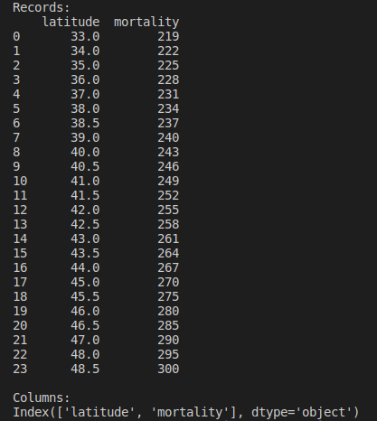
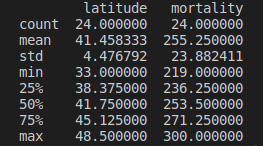
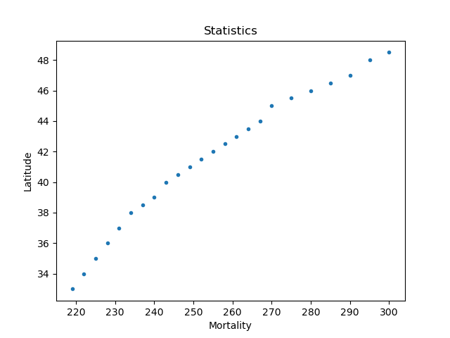
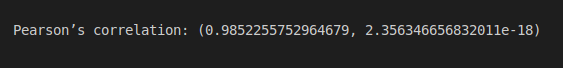

Practical Exercise

## Prerequires
For these practical exercises, you must install the libraries below.
- <a target="_blank" href="https://pypi.org/project/pandas/">pandas</a>
- <a target="_blank" href="https://pypi.org/project/numpy/">numpy</a>
- <a target="_blank" href="https://pypi.org/project/seaborn/">seaborn</a>
- <a target="_blank" href="https://pypi.org/project/matplotlib/">matplotlib</a>
- <a target="_blank" href="https://pypi.org/project/statsmodels/">statsmodels</a>
- <a target="_blank" href="https://pypi.org/project/scipy/">scipy</a>

Resolution Imagens
1.  Load the data and print the column names

2.  Generate descriptive statistics for the data

3.  Create a line plot for the variables. Add a title and x & y axes.
    - Beautify the x-labels
    - plot a line graph

    

4.  Create a scatter plot / Add title and (X,Y) axis names

5.  Create a boxplot for mortality

6.  Conduct a Pearson’s correlation test for the variables

7.  Create a pair plot for the data

9.  Create a Seaborn regplot of the regression model and a 95% confidence interval
#plot the regression model y ~ x and a 95% confidence interval for that 

