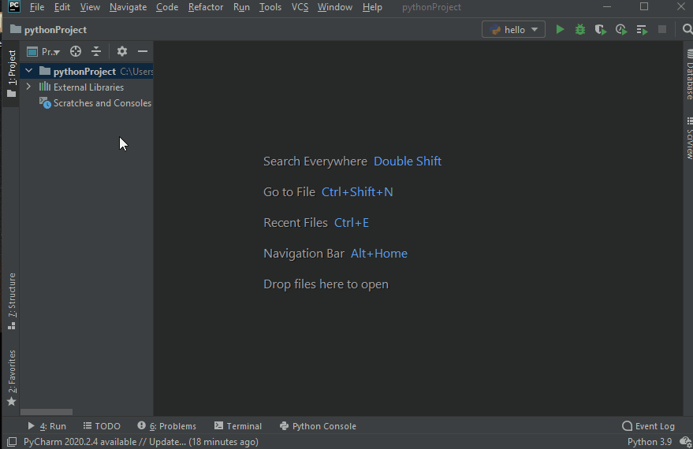

# Python is easy
 Introductory python course, offered by `Open Source IT`.

## Pre requirements

- Python (https://www.python.org/downloads/)
- Python interpreter
    - PyCharm (https://www.jetbrains.com/pycharm/download/)
    - Anaconda (https://www.anaconda.com/)
    - Jupyter (https://jupyter.org/install)

There are other alternatives you can use `VS Code`,` Sublime Text` but you must install the extension or the package to program in `Python`.
List of some extensions and packages:
- VS Code (https://code.visualstudio.com/download)
    - Python by Microsoft
    - Anaconda Extension Pack by Microsoft

- Sublime Text (https://www.sublimetext.com/3)
    - Python 3

## Installation

The installation of python is done according to the operating system.
First, you must download `python` from the official website, and your IDE` PyCharm` or another chosen one.

See how to install at:
-   https://www.python.org/about/gettingstarted/
-   https://www.jetbrains.com/pycharm/

## First program

The following example shows how to create your first `python` program using` PyCharm`.

## Recommended manuals

-   Python All-in-One For Dummies
-   Python Programming for the Absolute Beginner
-   Python Programming. Python Programming for Beginners, Python Programming for Intermediates

## How to contribute

First you must have all the prerequisites installed on your machine, I recommend you to download and install [Git] (https://git-scm.com/downloads) then just clone the repository and send your contributions to solve the problems. Exercises.